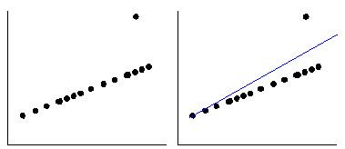

# Assumptions for Linear Regression

## Introduction
Least Squares is the most common regression technique for linear models. As long as our model satisfies the least squares regression assumptions, we can get the best possible estimates.

## Objectives
You will be able to:

- Understand and discuss the assumptions that must be held for least squares regression
- Understand linearity, normality and heteroscedasticity assumptions
- Identify approaches to check for regression assumptions

## About regression
Regression is a powerful analysis technique that is routinely used to answer complex analytical questions. However, if you don’t satisfy some of the assumptions, you might not be able to trust the results.

In this lesson, we shall look at ordinary least squares regression assumptions and their importance as well as some techniques to help us determine whether our model satisfies the assumptions.

## Regression is "Parametric"

Regression is a parametric technique i.e. it uses parameters learned from the data, so it makes certain assumptions. These assumptions define the complete scope of regression analysis and it is **mandatory** that underlying data fulfills these assumptions. If these assumptions are violated, regression makes biased and unreliable predictions. Luckily, we have measures to check for these assumptions which will be mentioned below. 

## Linearity

> Linearity assumptions requires that there should be a **linear relationship** between the response variable (Y) and predictor (X). Linear means that the change in Y by 1-unit change in X, is constant. 

As shown above, If we try to fit a linear model to a non-linear data set, Ordinary Least Squares (OLS) would fail to capture the trend mathematically, thus resulting in an inaccurate relationship. Also, this will result in erroneous predictions on an unseen data set.  

>The linearity assumption can best be tested with scatter plots 

For non-linear relationships, we can use non-linear mathematical functions to fit the data e.g. polynomial and exponential functions. These will be covered soon in the course.

**Note: As an extra measure, you must also check for outliers as presence of outliers in the data can have a major impact on the model.**

In the above example, we can see that an outlier prohibit the model to estimate the true relationship between variables by introducing bias. 

## Normality 

>Satisfying the normality assumption allows you to perform statistical hypothesis testing and generate reliable confidence intervals and prediction intervals.

Linearity assumption requires variables to be normally distributed for concluding some sort of statistical significance. It also requires that the calculated error values also follow a normal distribution to produce unbiased estimates with the minimum variance.

However, keep in mind that this assumption is not mandatory for regression if you dont want to do any hypothesis testing. OLS works fine for non-normal data distributions in the context of prediction. 

The easiest way to check for this assumption is with histograms or a Q-Q-Plots. 

### Histograms
We have already seen quite a few histograms and also know how to build them for data variables while plotting the density function through parametric and non parametric means. On the same lines, the errors generated by the model can also be checked for normality. As the error term follows a normal distribution, we can develop a better confidence on the results and thus calculate the statistical significance. An example of a regression error histogram is shown below:

### Q-Q Plots

>In statistics, a Q–Q (quantile-quantile) plot is a probability plot, which is a graphical method for comparing two probability distributions by plotting their quantiles against each other.

The Q-Q plot (quantile-quantile plot) is used to help assess if a dataset comes from a known distribution such as a Normal or exponential etc. For regression, when checking if the data is Normally distributed, we can use a Normal Q-Q plot to check that assumption. Remember It is just a visual check, not quantitative, so its interpretation remains subjective. However, it is a good first check to see the overall shape of data against required distribution. If you can reject normality through QQ plot, you have saved yourself from lot of statistical testing. You must, however, be very careful when deciding that data is totally normal, just by looking at a QQ plot. Here is an example comparing histograms and corresponding qqplots. We can see how the quantiles of normal data appear as a straight line along the diagonal when plotted against a standard normal distribution's quantiles. The skewness and kurtosis of data can also be inspected in the same way.  

So we see that a qq plot helps us validate the assumption of normal distribution. It uses standardized values of residuals to determine the normal distribution of errors. Ideally, this plot should show a straight line. A curved, distorted line suggests residuals have a non-normal distribution.[Here is a good article](https://data.library.virginia.edu/understanding-q-q-plots/) explaining the interpretation of qqplots in detail. 

Normality can be checked with a goodness of fit tests, e.g., the Kolmogorov-Smirnov test.  When the data is not normally distributed a non-linear transformation (e.g., log-transformation) also fixes this issue.

## Heteroscedasticity 

> heteroscedasticity (also spelled heteroskedasticity) refers to the circumstance in which the variability of a variable is unequal across the range of values of a second variable that predicts it.

A scatterplot of these variables will often create a cone-like shape, as the scatter (or variability) of the dependent variable  widens or narrows as the value of the independent variable increases. The inverse of heteroscedasticity is homoscedasticity, which indicates that a DV's variability is equal across values of an IV.

So a scatter plot is good way to check whether the data are homoscedastic (meaning the residuals are equal across the regression line).  The following scatter plots show examples of data that are not homoscedastic (i.e., heteroscedastic). You can also use significance tests like Breusch-Pagan / Cook – Weisberg test or White general test to detect this phenomenon. If we find p < 0.05, we reject the null hypothesis and infer that heteroscedasticity is present.

There are other assumptions for linear regression that applies to more complicated cases and will be covered as we go through advanced techniques. 

As a first check, always looks at plots for the residuals (we shall make a few in following lessons) and if you see anything similar to shown below, you are violating one or more assumptions and hence the results are not reliable and will lack confidence. 

## Summary 

In this lesson, we looked at some assumptions for simple linear regression that must be held in order to interpret the results reliably. As mentioned earlier, once these assumptions are confirmed, we can run our regression model and further our experiments based on our observations. Next we shall see all of this with examples. 
